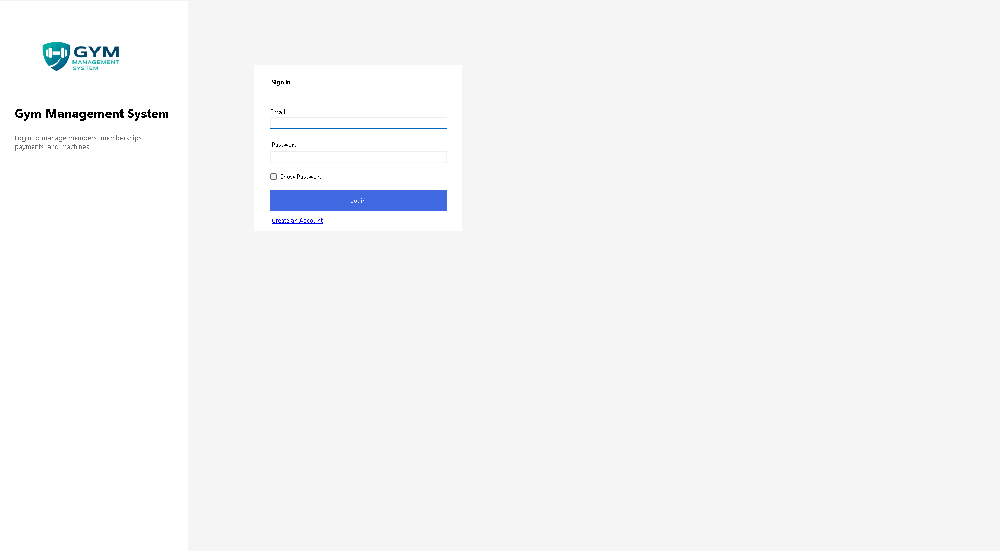
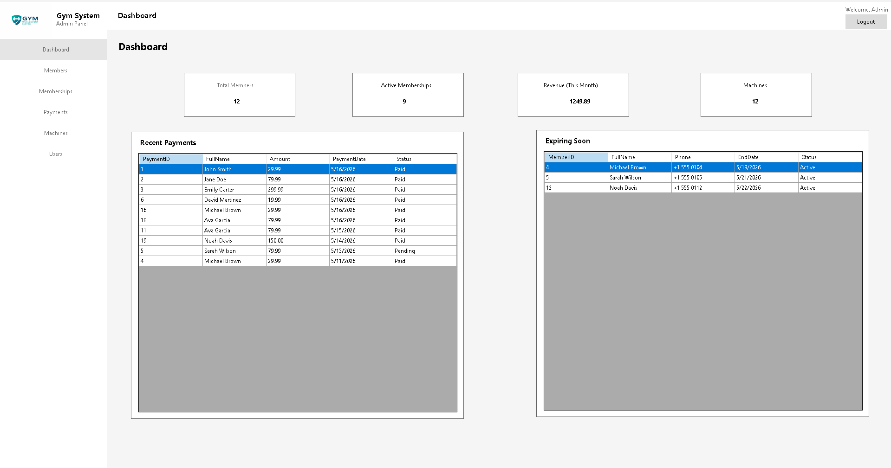
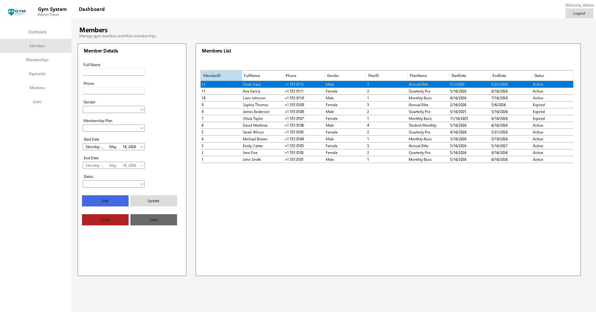
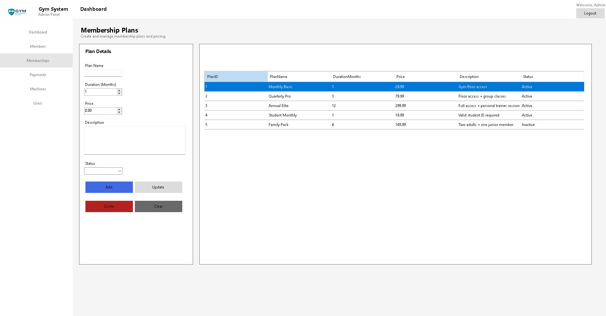
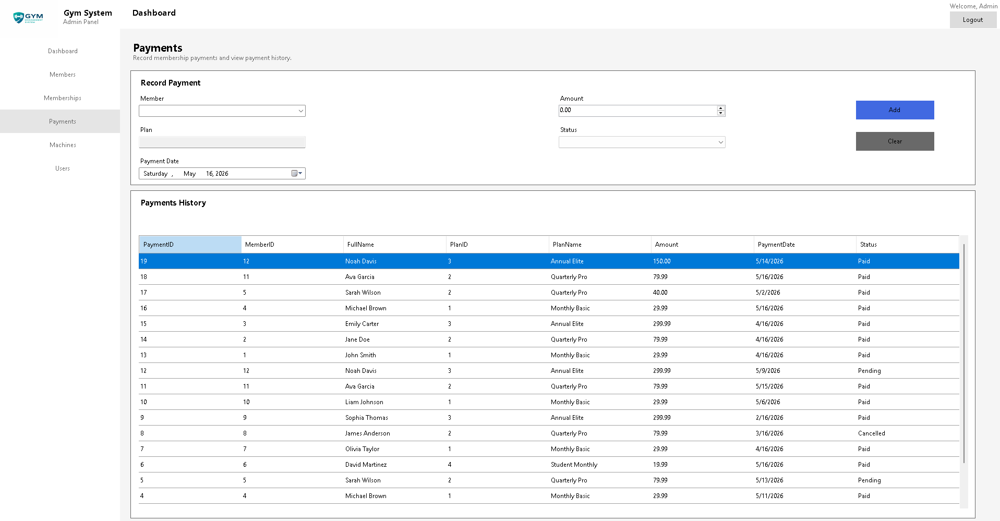
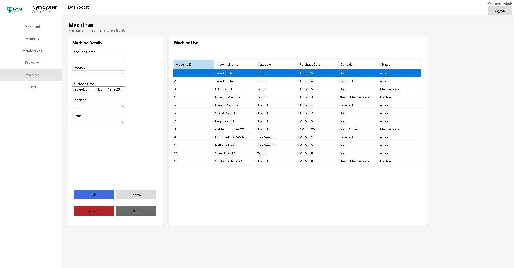
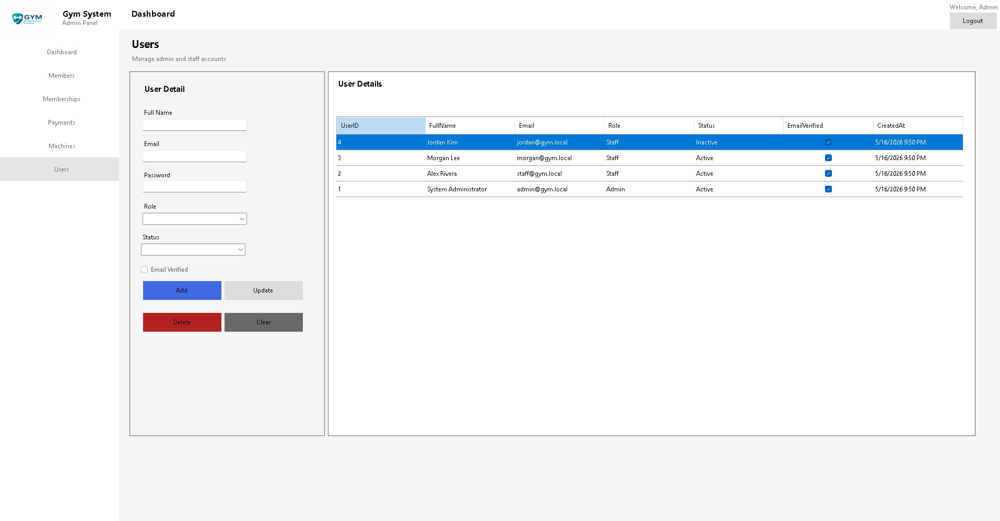

# Gym Management System

A **desktop business management application** for gyms, built with **C# WinForms** and **Microsoft SQL Server**. This is a portfolio and learning project — not a production enterprise system — focused on CRUD operations, authentication, and database-backed desktop workflows.

---

## Project Overview

Staff and administrators use a Windows desktop interface to manage members, membership plans, payments, gym equipment, and system users. Data is stored in a relational SQL Server database and accessed with **ADO.NET** using **parameterized queries**.

---

## Features

| Module | Capabilities |
|--------|----------------|
| **Authentication** | Login, staff signup, simulated email verification, SHA-256 password hashing |
| **Role-based access** | Admin-only user management (UI + code checks); Staff access to operational modules |
| **Dashboard** | Member counts, active memberships, machine totals, monthly revenue, recent payments, expiring memberships |
| **Members** | Add, update, delete members; automatic Active/Expired status |
| **Membership plans** | Manage plan name, duration, price, description, and status |
| **Payments** | Record payments linked to members and plans |
| **Machines** | Track equipment category, condition, purchase date, and status |
| **Users (Admin)** | Manage accounts, roles, and status (admin only) |

---

## Technologies Used

- **C#** (.NET Framework 4.7.2)
- **Windows Forms (WinForms)**
- **ADO.NET** (`System.Data.SqlClient`) with parameterized queries
- **Microsoft SQL Server**
- **SHA-256** password hashing

---

## Security Notes (Portfolio Project)

- All user input in SQL commands uses **SqlParameter** (SQL injection mitigation).
- Connection strings are stored in `App.config` (use `App.config.example` as a template).
- Public signup creates **Staff** accounts only; **Admin** accounts come from seed data or the admin panel.
- Passwords are hashed before storage; verification codes are simulated (MessageBox, not real email).

---

## Screenshots

| Login | Dashboard |
|-------|-----------|
|  |  |

| Members | Memberships |
|---------|---------------|
|  |  |

| Payments | Machines |
|----------|----------|
|  |  |

| Users (Admin) |
|---------------|
|  |

---

## Database Setup

See **[database/README.md](database/README.md)**.

1. Run `database/01_CreateDatabase.sql` in SSMS (**drops existing tables**).
2. Run `database/02_SeedData.sql` (safe to re-run; skips duplicates).
3. Set `GymManagementSystem/App.config` connection string:

```xml
<add name="GymDb"
     connectionString="Server=localhost;Database=GymManagementSystem;Integrated Security=True;"
     providerName="System.Data.SqlClient" />
```

---

## How to Run

### Prerequisites

- Windows 10/11
- .NET Framework 4.7.2
- [.NET SDK](https://dotnet.microsoft.com/download) (for `dotnet build`)
- SQL Server

### Quick start

```powershell
# 1. Run database scripts in SSMS
# 2. Update GymManagementSystem/App.config with your SQL Server instance
# 3. From repository root:
.\run.ps1
```

Manual build:

```powershell
dotnet build GymManagementSystem/GymManagementSystem/GymManagementSystem.csproj
.\GymManagementSystem\GymManagementSystem\bin\Debug\net472\GymManagementSystem.exe
```

> Run the `.exe` or `run.ps1` — not `dotnet GymManagementSystem.exe`.

---

## Login Credentials (Demo)

| Role  | Email            | Password   |
|-------|------------------|------------|
| Admin | admin@gym.local  | Admin123!  |
| Staff | staff@gym.local  | Admin123!  |
| Staff | morgan@gym.local | Admin123!  |

Public **Sign up** registers **Staff** only. Complete email verification using the code shown in the dialog.

---

## Project Structure

```
GymManagementSystem/
├── database/                    # SQL scripts
├── docs/screenshots/
├── GymManagementSystem/
│   ├── Helpers/
│   │   ├── AuthRoles.cs
│   │   ├── DatabaseHelper.cs
│   │   └── ErrorMessageHelper.cs
│   ├── Main/FrmMain.cs
│   ├── FrmLogin.cs, FrmSignup.cs, FrmVerifyEmail.cs
│   ├── UC_*.cs
│   ├── PasswordHelper.cs
│   ├── App.config.example
│   └── App.config
├── run.ps1
└── README.md
```

---

## Future Improvements

- Stronger password hashing (salt + PBKDF2/bcrypt)
- Repository / service layer separation
- Entity Framework or Dapper
- Real email verification (SMTP)
- Unit tests and CI build workflow
- Payment update/delete and reporting exports

---

## Author

**Jad Banjak**

- GitHub: [https://github.com/Jad-Banjak](https://github.com/Jad-Banjak)
- LinkedIn: [https://www.linkedin.com/in/jadbanjak/](https://www.linkedin.com/in/jadbanjak/)

---

## License

Portfolio and educational use. Add an MIT license file if you open-source the repository.
